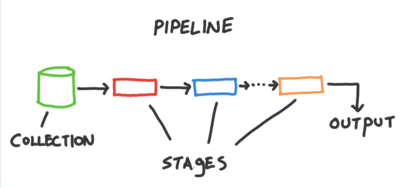

# Base de Datos Avanzadas  
#### Maestría en Ciencia de Datos v2
#### Universidad Católica Boliviana "San Pablo"
#### Guery Favio Ramirez Martinez

## 1.- Proceso de configuración de alta disponibilidad
EL Obejtivo de la creacíon de Replicaset Es proporcionar ALta Disponibilidad de nuestras bases de datos MongoDB. La idea consiste en tener corriendo varias instancias de mongo con el fin de que la información se replique entre ellas, de tal forma que si el nodo primario se cae, pueda ser remplazado automáticamente por otro.
### 1.1 Esquema de Red


### 1.2 Configuración
EL  sistema base es linux en su version neon, correspondiente a la familia debian de tal forma se realiza la actualización de los repositorios y paquetes 

```
sudo apt update
sudo apt upgrade
```
A ada servidor una dirección IP fija a través de Netplan.
Lo primero será comprobar si ya disponemos de algún archivo de configuración:
```
sudo nano /etc/netplan/50-netcfg.yaml
```
Por ejemplo de la configuración  de unos de los servidores puede ser la siguiente:
```
	network:
	ethernets:
	    enp0s3:
	        addresses: [192.168.1.210/24]
	        dhcp4: no
	        gateway4: 192.168.1.1
	        nameservers:
	            addresses: [8.8.8.8, 8.8.4.4]
	version: 2
```
Una vez guardado nuestra configuración la podemos aplicar con el siguiente comando.
```
 sudo netplan apply 
```
Si durante la instalación del sistema operativo no hemos configurado el hostname correctamente o hemos partido de un clon de otra máquina virtual, lo cambiaremos por el que corresponda.
```
sudo nano /etc/hostname
```
Entonces para el nodo 1 será:
```
mongodb-01
```
Para que este cambio sea persistente a los reinicios editaremos el siguiente archivo.
```
sudo nano /etc/cloud/cloud.cfg
```
Y pondremos el siguiente setting a *true*.

```
preserve_hostname: true
```
También lo cambiaremos en el archivo host:
```
sudo nano /etc/hosts
```
Además de cambiar su nombre, también tenemos que añadir el Hostname y la Dirección IP de los otros dos nodos.
```
    192.168.1.210	mongodb-01
    192.168.1.211   mongodb-02
    192.168.1.212   mongodb-03
```
Se debe reiniciar los servidores para que los cambios se observen.
```
sudo reboot
```
## Instalación de Replica Set

### Instalación de MongoDB
Antes de empezar a configurar el Replica Set se necesita tener instalado MongoDB de forma independiente en cada servidor.

Importar la clave pública utilizada por el sistema de gestión de paquetes.
```
sudo apt-key adv --keyserver hkp://keyserver.ubuntu.com:80 --recv 9DA31620334BD75D9DCB49F368818C72E52529D4
```
Se importa el repositorio de MongoDB.
```
echo "deb [ arch=amd64 ] https://repo.mongodb.org/apt/ubuntu bionic/mongodb-org/4.0 multiverse" | sudo tee /etc/apt/sources.list.d/mongodb-org-4.0.list
```
Se procede con la instalación de MongoDB.
```
sudo apt-get install -y mongodb-org
```
## Configuración del Replica Set

Ahora se procede a realizar todas las configuraciones necesarias para el Replica Set.

Se edita el archivo **mongod.conf** en todos los servidores.
```
sudo nano /etc/mongod.conf
```
Se modifica el siguiente contenido con la dirección IP correspondiente de cada uno.
 1. mongodb-01:
  	net:
  	  port: 27017
  	  bindIp: 192.168.1.210

 1. mongodb-02:
  	net:
  	  port: 27017
  	  bindIp: 192.168.1.211

 1. mongodb-03:
  	net:
  	  port: 27017
  	  bindIp: 192.168.1.212
Y en el mismo archivo se añade el nombre del Replica Set que sera el mismo para todos (**replica01**).
```
replication:
	  replSetName: "replica01"
```
Se habilta el servicio **mongod** para que se inicie automáticamente cuando se arranquen los servidores.
```
sudo systemctl enable mongod.service"
```
Se reinicia el servicio mongod para que actualice los cambios realizados anteriormente en el archivo mongod.conf.
```
sudo systemctl restart mongod.service
```
Uno de los nodos de MongoDB se ejecuta como PRIMARIO (**MASTER**), y todos los demás nodos funcionarán como SECUNDARIO (**SLAVE**). Los datos están siempre en el nodo PRIMARIO y los conjuntos de datos se replican en todos los demás nodos SECUNDARIOS.

Para configurar el Replica Set se inicia la terminal en uno de los nodos.
```
sudo systemctl restart mongod.service
```
Se inicia el conjunto de réplicas en el nodo 1 ejecutando el siguiente comando.
```
rs.initiate()
```
Posteriormente se añade los otros dos nodos al Replica Set.
```
rs.add("mongodb-02")
rs.add("mongodb-03")
```
Se puede comprobar el estado del RPS ejecutando:
```
rs.status()
```
En el caso de que en el nodo 1 se haya puesto la dirección IP en vez de el nombre, podemos cambiarlo ejecutando los siguientes comando:
>
> ```
> cfg = rs.conf()
> cfg.members[0].host = "mongodb-01:27017"
> rs.reconfig(cfg)
> ```

Y el siguiente comando nos dirá cual de los nodos es el MASTER.
```
rs.isMaster()
```
### Probando Alta Disponibilidad
Una vez tenemos configurado nuestro Replica Set solo queda realizar pruebas para ver si realmente funciona.

Ahora procedemos a parar el servicio de mongodb-01.
```
sudo service mongod stop
```
Si refrescamos la conexión se observa como podemos seguir conectándonos y accediendo a nuestro datos pero en este caso el nodo 1 mongodb-01 esta sin conexión, mongodb-02 a pasado a ser el nodo PRIMARIO y mongodb-03 sigue estando como SECUNDARIO. 

## 2.- Diccionario de datos
### Collection clientes 
| Idx | Nombre | Data Type | Descripción|
|---|---|---|---|
| *🔑 ⬋ | <a name='movies.clientes__id'>&#95;id</a>| string  |
| *| <a name='movies.clientes_nombreCompleto'>nombreCompleto</a>| string  | Nombre completo del cliente|
| *| <a name='movies.clientes_celular'>numeroCelular</a>| string  |Celular del cliente|
| *| <a name='movies.clientes_fechaNacimiento'>fechaNacimiento</a>| date  |Fecha de Nacimiento del Cliente|
|  | <a name='movies.clientes_correo'>correoElectronico</a>| string  ||
| *| <a name='movies.clientes_direccion'>direccion</a>| string  ||
| *| <a name='movies.clientes_latitud'>latitud</a>| string  ||
| *| <a name='movies.clientes_longitud'>longitud</a>| string  ||
| *| <a name='movies.clientes_createAt'>createAt</a>| date  ||
| *| <a name='movies.clientes_updateAt'>updateAt</a>| date  ||
|  | <a name='movies.clientes_deleteAt'>deleteAt</a>| date  ||
|  | <a name='movies.clientes_bloqueado'>bloqueado</a>| boolean  ||
|  | <a name='movies.clientes_motivoBloqueo'>motivoBloqueo</a>| string  ||


### Collection prestamos 
| Idx | Nombre | Data Type | Descripción |
|---|---|---|---|
| *🔑 | <a name='movies.prestamos__id'>&#95;id</a>| string |
| *⬈ | <a name='movies.prestamos_videos'>videos</a>| array  | Id de la coleccion video|
| *| <a name='movies.prestamos_fechaDevolucion'>fechaDevolucion</a>| date  | Fecha de la devolucion| 
| *| <a name='movies.prestamos_diasPrestamo'>diasPrestamo</a>| integer  | Dias de prestamo|
| *| <a name='movies.prestamos_importeTotal'>importeTotal</a>| integer  | Monto total con descuento|
| *| <a name='movies.prestamos_devuelto'>devuelto</a>| boolean  | Indica si el video fue devuelto |
| *| <a name='movies.prestamos_createAt'>createAt</a>| date  |
| *| <a name='movies.prestamos_updateAt'>updateAt</a>| date  |
|  | <a name='movies.prestamos_deleted'>deleted</a>| boolean  |
|  | <a name='movies.prestamos_deleteAt'>deleteAt</a>| date  |


### Collection videos 
| Idx | Nombre | Data Type | Descripción |
|---|---|---|---|
| *🔑 ⬋ | <a name='movies.videos__id'>&#95;id</a>| string  |
| *| <a name='movies.videos_titulo'>titulo</a>| string  | Nombre de la pelicula|
| *| <a name='movies.videos_genero'>genero</a>| array  | Generos de la pelicula|
| *| <a name='movies.videos_anioPublicacion'>anioPublicacion</a>| integer  | Anio de la publicacion de la pelicula|
| *| <a name='movies.videos_duracion'>duracion</a>| integer  | Duración de la película en minutos|
|  | <a name='movies.videos_nominaciones'>nominaciones</a>| object  | Nominaciones y premios de la pelicula|
| *| <a name='movies.videos_nominaciones.wins'>nominaciones&#46;wins</a>| integer  |
| *| <a name='movies.videos_nominaciones.nominations'>nominaciones&#46;nominations</a>| integer  |
| *| <a name='movies.videos_nominaciones.text'>nominaciones&#46;text</a>| string  |
| *| <a name='movies.videos_costoUnitario'>costoUnitario</a>| double  |Costo unitario de la pelicula|
| *| <a name='movies.videos_copias'>copias</a>| integer  |Cantidad de copias adquiridas|
| *| <a name='movies.videos_createAt'>createAt</a>| date  |
| *| <a name='movies.videos_updateAt'>updateAt</a>| date  |
| *| <a name='movies.videos_deleted'>deleted</a>| boolean  |
|  | <a name='movies.videos_deleteAt'>deleteAt</a>| date  |


## 3.- Mongo DB Agregaciones
El marco de agregación se basa en el concepto de canalización. la imagen lo explica mejor:



Se obtiene una colección y la pasamos a través de una tubería. Esta canalización consta de ciertas etapas en las que ciertos operadores modifican los documentos de la colección utilizando diversas técnicas. Finalmente, la salida se devuelve a la aplicación que llama a la consulta.

Se puede comparar con una consulta simple, como buscar. Claro, funciona en la mayoría de las formas, pero no es realmente útil cuando también desea modificar los datos mientras los recupera.

O se debe buscar los documentos y modificarlos en consecuencia en la aplicación en el servidor, o peor aún, los enviará al cliente y dejará que el código de la interfaz lo modifique por usted.

En ambos casos, se está desperdiciando recursos y ancho de banda. Por lo tanto, el marco de agregación aborda este problema de manera ordenada. Veamos cómo lo hace con los operadores.

### 3.1 Pipeline

### 3.2 Pipeline Operators
En MongoDB, la canalización es una matriz que consta de varios operadores, que toman un montón de documentos y muestran documentos modificados de acuerdo con las reglas especificadas. El siguiente operador toma los documentos obtenidos por el operador anterior, por lo tanto, se llama canalización.

Puede tener muchos operadores en una canalización y estos operadores también se pueden repetir, a diferencia de las consultas habituales de MongoDB.

### $group
Este operador le permite agrupar un montón de documentos sobre la base de un determinado campo en los documentos. También se puede utilizar para agrupar los distintos campos de los documentos.

### $match
El operador de canalización de coincidencias funciona de manera muy similar a cómo funciona el operador de búsqueda normal. Sin embargo, lo bueno de esto es que se puede usar varias veces porque se encuentra en un entorno de canalización.

### $limit
El operador de canalización $ skip omite los primeros N documentos y pasa el resto de los documentos al siguiente operador.

### $skip
El operador de canalización $ skip omite los primeros N documentos y pasa el resto de los documentos al siguiente operador

### $unwind
Este operador toma un campo de matriz y lo descompone en múltiples N subdocumentos con el i-ésimo documento que contiene el i-ésimo valor particular de matriz como el valor del nombre del campo.

### $project
El operador del proyecto le permite extraer un montón de campos de cada documento y descartar el resto. No solo eso, sino que también puede cambiar el nombre de los campos pinchados, cadenas concat, eliminar subcadenas y mucho más.

## 4.-Mejores prácticas para usar el marco de agregación
También se puede explotar fácilmente el marco de agregación para realizar consultas simples, por lo que es importante asegurarse de no escribir consultas de base de datos deficientes.

Para empezar, tenga en cuenta los siguientes puntos:

MongoDB rechazará cualquier operador que ocupe más de 100 MB de RAM y generará un error. Por lo tanto, asegúrese de recortar sus datos lo antes posible, ya que un solo operador no debería ocupar más de 100 MB de memoria.

Poner $ match primero reducirá la cantidad de documentos que se pasan al resto de la canalización. 

Poner $ project a continuación reducirá aún más el tamaño de un documento individual al eliminar los campos.

Finalmente, todo el trabajo que requiere el uso de campos indexados (ordenar, emparejar, etc.) antes de usar operadores. Esto se debe a que estos operadores crean nuevos documentos que no tienen los índices del documento original.

## 5.-Conclusión
MongoDB es una excelente herramienta de base de datos y puede ser realmente útil para pequeñas empresas y empresas que desean iterar rápidamente. Esto se debe en parte a sus restricciones flexibles y su naturaleza indulgente.
