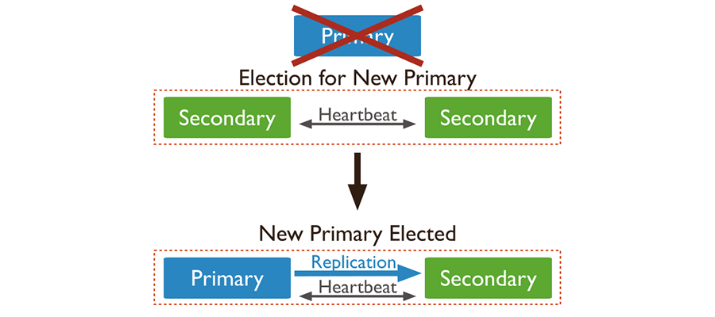

# Base de Datos Avanzadas  
#### Maestría en Ciencia de Datos v2
#### Universidad Católica Boliviana "San Pablo"
#### Guery Favio Ramirez Martinez

## 1.- Proceso de configuración de alta disponibilidad
EL Obejtivo de la creacíon de Replicaset Es proporcionar ALta Disponibilidad de nuestras bases de datos MongoDB. La idea consiste en tener corriendo varias instancias de mongo con el fin de que la información se replique entre ellas, de tal forma que si el nodo primario se cae, pueda ser remplazado automáticamente por otro.
### 1.1 Esquema de Red

## 2.- Modelo de datos 

## 3.- Mongo DB Agregaciones
### 3.1 Pipeline
### 3.2 Pipeline Operators
### $group
### $match
### $limit
### $skip
### $unwind
### $project

## 4.-Rendimiento y Análisis de Consultas
